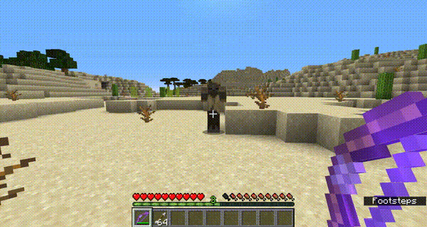
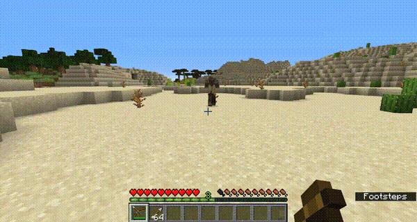
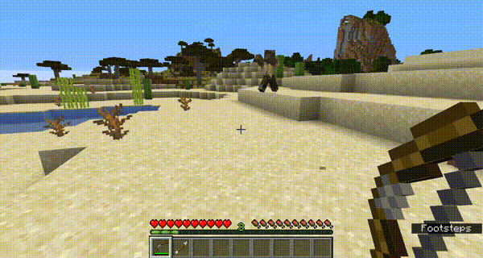
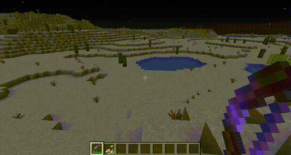

 

# Power Projectiles
This is a Minecraft Plugin for Bukkit/Paper/Spigot servers that adds several new
super-powered projectiles that make the standard potion-tipped arrows look boring.

<!-- BADGES -->

## Crafting and Use
As long as a player has gotten the Enchanter advancement, he/she can also see 
the recipe for all Power Projectiles. Each projectile's lore (the text below its
name) contains instructions for how to use it.

## The Projectiles
| Name | Effect | Gif |
|------|--------|-----|
|💥 **Explosive Arrow** | Causes a small explosion on impact. |  |
|🔥 **Forest Fire Arrow** | Starts a medium sized fire on impact. |  |
|🧟 **Horde Arrow** | Temporarily spawn several baby zombies. *NEW in v1.11.0!* | Example image not yet available |
|⛓ **Jail Arrow** | Surrounds a hit enemy with iron bars. *NEW in v1.8.0!* |  |
|⚡ **Lightning Arrow** | Summons a bolt of lightning at the site of impact. *NEW in v1.10.0!* | Example image not yet available |
|🕸 **Net Arrow** | Places cobwebs on impact to drastically slow down your enemies. |  |
|🎯 **Sniper Arrow** | Ignores gravity and flies extra fast to directly hit targets in your crosshairs. | Example image not yet available |
|👥 **Swap Arrow** | Causes you and a hit enemy to trade locations on the map. | Example image not yet available |
|🤸‍♀️ **Teleport Arrow** | Teleports you to wherever it lands. | Example image not yet available |
|🕯 **Torch Arrow** | Places a torch wherever it lands. |  |

## Installation
1. Download the [latest release](https://github.com/thehale/power-projectiles/releases/) of Power Projectiles from GitHub Releases.
2. Copy the downloaded `power-projectiles-VERSION.jar` into your server's `plugins` directory.

## Contributing
 * Please report any issues you find on the `Issues` tab.
 * If you want to develop new features, feel free to open a pull request.

While developing, use the command `./gradlew runDevServer` to run a Paper server
with your changes loaded.

### Building Power Projectiles from Source
1. Download the source code: `git clone https://https://github.com/thehale/power-projectiles.git`.
2. Open a terminal in the root folder of the project.
3. Build the jar: `./gradlew build`.
4. Copy the generated jar from `./build/libs/power-projectiles.jar` into your server's `plugins` directory.

### Adding new Power Projectiles
Simply inherit from Power Arrow and implement the required abstract
methods to make your own Power Arrow!

Other types of Power Projectiles will come in the future.
